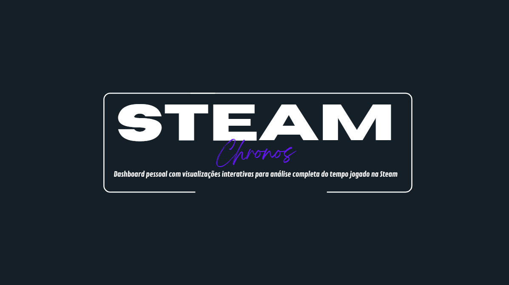

<h1 align="center">
  ⏳   Steam Chronos API
</h1>

 
 
  
 
 
 

<h4 align="center"><a href="https://jvmntr.github.io/portfolio/">Clique para visitar a documentação da API.</a></h4>

> Para esta versão inicial, a API foi projetada para um único usuário (configurado via variáveis de ambiente), com foco na complexidade da coleta e análise dos dados. A implementação de um sistema multi-usuário com autenticação (OAuth, JWT) é um passo planejado para o futuro.

## ✨ Funcionalidades

### 📥 Coleta e Armazenamento de Dados
- **Integração com a Steam**: Utiliza a API Web oficial da Steam para buscar a lista completa de jogos e o tempo jogado de um usuário específico.

- **Persistência de Dados**: Armazena todas as informações em um banco de dados **PostgreSQL**, permitindo análises históricas complexas.

- **Snapshots de Tempo**: Cria "snapshots" periódicos do tempo total jogado, permitindo o cálculo de tempo jogado em intervalos específicos.

- **Automação Agendada**: Usa **Cron Jobs** para executar a coleta automaticamente (ex: todos os dias às 3 da manhã), garantindo dados sempre atualizados.

- **Log de Sincronização**: Registra o status de cada tarefa de coleta de dados, informando o resultado (sucesso/falha) e a hora de execução.

## 🔗 Endpoints da API

 `GET /api/dashboard/summary`  
  Retorna um resumo com a contagem total de jogos e o mais jogado da última semana.

 `GET /api/dashboard/report`  
  Fornece um relatório de tempo jogado por jogo, com períodos flexíveis (`weekly`, `monthly`, `yearly`).

 `GET /api/dashboard/activity-by-day`  
  Analisa o histórico e retorna o total de minutos jogados em cada dia da semana.

 `GET /api/games/:appId/history`  
  Retorna uma série temporal com todo o histórico de snapshots para um jogo específico.

 `POST /api/sync/run`  
  Endpoint para disparar a sincronização com a Steam manualmente.

 `GET /api/sync/status`  
  Retorna o status da última tarefa de sincronização executada.

## 💼 Tecnologias Utilizadas

### 🔧 Back-end
- **Node.js** – Ambiente de execução
- **Nest.js** – Framework principal
- **TypeScript** – Tipagem estática e segura

### 🗄️ Banco de Dados
- **PostgreSQL** – Banco relacional robusto
- **Prisma** – ORM moderno com tipagem

### ⚙️ Automação e APIs
- **Nest.js Schedule** – Cron Jobs agendados
- **Axios** – Requisições à API da Steam

### 📄 Documentação
- **Swagger (OpenAPI)** – Documentação interativa da API

### 🧹 Qualidade de Código
- **ESLint**
- **Prettier**

## ✒️ Feito por

**Feito com 🖤 por João 'Jvmntr' Monteiro** \
[**Desenvolvedor fullstack**]    

 
